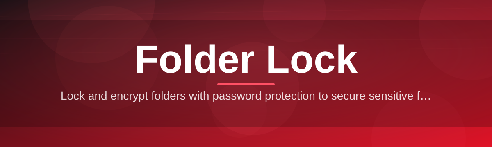
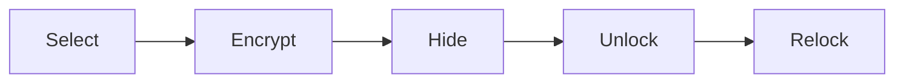

# folder-lock-manager 🔒🗂️

  

*Turn any folder into a vault — lock it, hide it, forget it existed.*

  

## 📖 Overview

**folder-lock-manager** is a lightweight Windows utility built for one job: keeping specific folders off-limits to anyone who isn't you. No cloud accounts, no background services phoning home, no bloated suite of "security" tools you'll never open. Just a focused folder lock that sits quietly on your desktop and does exactly what its name promises.

The idea behind folder locking is old, but most tools that implement it are either abandoned, riddled with ads, or built on shaky encryption that falls apart under scrutiny. This project takes a different route — a modern rewrite for 2026, designed around clarity of code, predictable behavior, and a UI that doesn't feel like it was frozen in 2009. Whether you're protecting tax documents, a shared-computer photo folder, or a work directory you don't want siblings/roommates/coworkers poking through, this tool gives you a straightforward lock-and-forget workflow.

It's built for everyday users first — students on shared laptops, freelancers with client folders, small teams on a single machine — but the internals are clean enough that developers can read through the source without wincing. If you've ever searched "how to lock a folder on Windows without third-party bloat," this is the answer we wished existed.

---

## 🧩 What It Actually Does

- **Instant folder locking** — select a directory, set a passphrase, and it's sealed from casual access in under two seconds.

- **Stealth mode hiding** — locked folders can be made invisible to standard Explorer browsing, not just password-gated.

- **Portable vault profiles** — export your locked-folder configuration and carry it between machines without re-locking everything.

- **Password strength meter** — real-time feedback while setting a passphrase so you don't lock yourself into a weak vault.

- **Auto-relock on idle** — folders re-secure themselves automatically after a configurable period of inactivity.

- **Multi-folder dashboard** — manage dozens of locked folders from a single scrollable list instead of hunting through Explorer.

- **Audit-friendly logging** — every lock/unlock event is timestamped locally, so you know exactly when a vault was opened.

- **Light and dark themes** — matches your OS preference or can be forced manually in settings.

> [!TIP]
> Lock your most-used folder first and pin it to the dashboard — this becomes your daily driver and shows you the workflow instantly.

---

## 🚀 Getting Started

1. **Visit the landing page** using the download button above.

2. **Download the standalone executable** — no installer wizard, no bundled extras.

3. **Run the app** — Windows may show a SmartScreen prompt on first launch since the binary is freshly signed; click "More info → Run anyway."

4. **Select a folder, set a passphrase, and lock it.** That's the entire learning curve.

> [!NOTE]
> No account creation, no email verification, no license key. The tool works fully offline from the first launch.

---

## 💻 System Requirements

| Requirement | Detail |
|---|---|
| OS | Windows 10 or Windows 11 (64-bit) |
| Dependencies | None — fully standalone |
| Disk space | Under 40 MB |
| RAM | Negligible, runs idle at ~15 MB |
| Internet | Not required after download |

  

---

## ⚙️ How It Works

The lock mechanism works in a short, predictable pipeline rather than some opaque black box:

1. **Select** a target folder through the dashboard or a right-click shortcut.

2. **Encrypt & seal** — folder metadata is restructured and access is gated behind your passphrase.

3. **Hide (optional)** — the folder can be dropped from normal Explorer view entirely.

4. **Unlock** — enter the passphrase to instantly restore full access.

5. **Auto-relock** — after your configured idle window, the folder seals itself again without any action from you.

> [!IMPORTANT]
> Losing your passphrase means losing access to that vault. There is no admin backdoor — that's the entire point of a real folder lock.

---

## 🛟 Troubleshooting

<strong>My locked folder isn't showing up in Explorer at all — is it gone?</strong>

No. If stealth mode is enabled, the folder is intentionally hidden from browsing. Open it from the app's dashboard, not Explorer.

<strong>I forgot my passphrase — can support recover it?</strong>

There's no recovery path by design. The lock relies entirely on your passphrase; storing a master override would defeat the purpose of a secure folder lock.

<strong>Windows Defender flagged the executable — is that normal?</strong>

Fresh binaries occasionally trigger heuristic warnings before reputation builds up. Verify you downloaded from the official landing page linked in this README.

<strong>Can I lock a folder that's currently open in another program?</strong>

Close any open files inside it first. Locking a folder with active file handles can fail or produce inconsistent state.

<strong>Does this work on network drives or USB drives?</strong>

Local drives are fully supported. Removable and network drives work but auto-relock timing may behave differently depending on connection stability.

---

## 🎨 UI & UX Details

- **Themes** — light, dark, or system-synced, switchable instantly from settings.

- **Dashboard-first design** — every locked folder is a card with status, last-unlocked time, and quick actions.

- **Keyboard shortcuts:**

  | Shortcut | Action |
  |---|---|
  | `Ctrl + L` | Lock selected folder |
  | `Ctrl + U` | Unlock selected folder |
  | `Ctrl + N` | Add new folder to dashboard |
  | `Ctrl + H` | Toggle hide/show stealth mode |
  | `Esc` | Close active dialog |

- **Adjustable idle timer** — set auto-relock anywhere from 1 minute to never.

> [!WARNING]
> Disabling auto-relock on a shared machine defeats most of the protection this tool provides. Use it deliberately, not by default.

---

## 🤝 Contributing & Community

Contributions, bug reports, and feature requests are welcome through Issues and Pull Requests. Before opening a PR:

- Keep changes scoped — one feature or fix per PR.

- Match existing code style; no unrelated reformatting.

- Describe *why* a change matters, not just *what* changed.

> [!TIP]
> Good first contributions: UI polish, translation strings, and troubleshooting doc improvements are all great entry points.

---

## 📄 License

Released under the [MIT License](LICENSE), 2026.

---

## ⚠️ Disclaimer

This tool provides folder-level access control for personal privacy and everyday organization purposes. It is not a substitute for enterprise-grade encryption or compliance-certified data protection. Use appropriate additional safeguards for sensitive regulated data.

---

